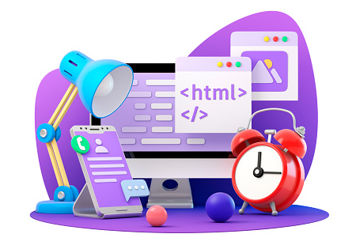

# Style Readme.md

#What is HTML?
Easy Learning with HTML "Try it Yourself"
With our "Try it Yourself" editor, you can edit the HTML code and view the result:

**Example**
<!DOCTYPE html>
<html>
<head>
<title>Page Title</title>
</head>
<body>

<h1>This is a Heading</h1>

This is a paragraph.

</body>
</html>
Click on the "[Try it Yourself](https://www.brakshamchemicals.com)" button to see how it works.

**HTML Examples**
In this HTML tutorial, you will find more than 200 examples. With our online "Try it Yourself" editor, you can edit and test each example yourself!

**HTML Exercises**
This HTML tutorial also contains nearly 100 HTML exercises.
